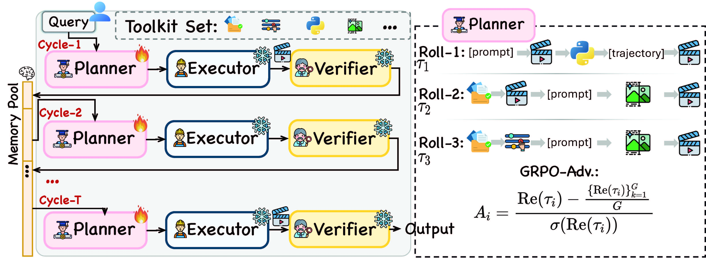

<p align="center">
    
</p>

<h1 align="center">Newton: Agentic Planning for Physics-Following Video Generation</h1>

<p align="center">
    <a href="https://newton026.github.io/newton/"></a>
    <a href="https://arxiv.org/abs/2605.18396"></a>
    <a href="LICENSE"></a>
</p>

<p align="center">
    <a href="#-about">About</a> •
    <a href="#-pipeline">Pipeline</a> •
    <a href="#-tools">Tools</a> •
    <a href="#-roadmap">Roadmap</a> •
    <a href="#-quickstart">Quickstart</a> •
    <a href="#-usage">Usage</a> •
    <a href="#-citation">Citation</a>
</p>

https://github.com/user-attachments/assets/b9b9879a-16fd-48e1-90b3-858f1165af61

<br>

# 🔭 About

Video generation models produce visually compelling results but systematically
violate physical commonsense — on VideoPhy-2, the best model achieves only 32.6%
joint accuracy. We identify a **specification bottleneck**: text prompts are a
lossy compression of the physical world, omitting the parameters that fully
determine dynamics, and no amount of model scaling can recover what was never
specified. From this diagnosis we derive three properties that physics
conditioning must satisfy — **sufficiency**, **dynamism**, and **verifiability**
— and show that no existing approach satisfies all three.

We present **Newton**, in which video generation is demoted from the system
output to one action inside an agent's toolbox: a learned planner orchestrates
physics-aware tools (keyframe generation, scientific computation, prompt
refinement) to construct rich conditioning, and a verifier closes the loop for
iterative re-planning. The planner is the sole trainable component, optimized
on-policy via Flow-GRPO inside the live multi-turn loop. On VideoPhy-2, Newton
improves joint accuracy from 21.4% to 29.7% on LTX-Video and from 30.7% to 37.4%
on Veo-3.1, **without modifying either generator**.

<br>

# 🛠️ Pipeline

<p align="center">
    
</p>

Newton runs a multi-turn **Planner → Executer → Verifier** loop. Given a user
prompt, the planner decides which tools to invoke; the video generator becomes
one tool among many, and the verifier feeds language-form feedback back for the
next round.

| Role | Component | What it does |
|------|-----------|--------------|
| **Planner** | Planner LLM | Reads the scenario, picks tools, writes the video prompt |
| **Executer** | Tools | `simulate` (Genesis physics), `make_keyframes` / `img_create` (key frames), `image_search`, Seedance video generation |
| **Verifier** | Gemini blind A/B | Scores the candidate against a text-only baseline; loop stops when it clearly wins |

Conditioning carries over between turns, so the planner amends what works
(keeps a good simulation, rewords the prompt, adds a keyframe) instead of
rebuilding each round.

<br>

# 🧰 Tools

The planner composes these tools to build physics conditioning. Each is exposed
as a skill (`planner_skills/`) the planner reads before calling.

| Tool | What it produces | When the planner uses it |
|------|------------------|--------------------------|
| 🌀 **simulate** | A physics-correct reference video + per-object trajectories, from a Genesis simulation of the scene | Contact-rich / multi-body motion, exact object counts, or any fluid / granular / soft-body / cloth behavior — anything text-to-video gets physically wrong |
| 🎞️&nbsp;**make_keyframes** | A first + last key-frame pair (last is an edit of the first, sharing subject/scene/lighting) | Anchor the video's start and end states with a strong i2v constraint |
| 🖼️ **img_create** | A single still image, from text (t2i) or as an edit of an existing one (i2i) | Build or fix one key frame / reference image |
| 🔍 **image_search** | Local paths to real photos found on the web by text query | Need an authentic appearance of a specific real object / place / style to condition on |
| ✍️ **prompt_refine** | The refined `video_prompt` text itself (no external call) | Write the initial caption, or fix one the verifier judged wrong |
| 🎥&nbsp;**video&nbsp;generation** | The candidate video (Seedance), conditioned on the prompt + staged references | Render a draft each turn — one tool among many, not the whole system |

<br>

# 🗺️ Roadmap

- [x] Release OpenNewton inference-time agentic loop
- [x] Compatibility with mainstream LLM / image / video generation APIs
- [ ] Release training code for open-sourced planner
- [ ] Release omni-conditioned video generator

<br>

# 🚀 Quickstart

## 1. 🐍 Environment

```bash
conda create -n newton python=3.10 -y && conda activate newton
# Install PyTorch first. We use torch 2.10 & CUDA 12.8 — adjust to your CUDA version.
pip install torch==2.10.0 torchvision==0.25.0 torchaudio==2.10.0 --index-url https://download.pytorch.org/whl/cu128
pip install -r requirements.txt
```


## 2. 🔑 API keys

Copy the template and fill in your credentials:

```bash
cp .env.template .env
```

Newton calls external APIs for the planner LLM, image generation, video
generation, web image search, and the video verifier. You can use official
providers (below) or any compatible third-party / locally-hosted endpoint:

| Service | Used for | Get a key |
|---------|----------|-----------|
| OpenAI-compatible LLM | Planner (function-calling) | https://openai.com/api/ |
| Gemini | Image generation + video verifier | https://ai.google.dev/gemini-api/docs |
| Seedance | Video generation | https://seed.bytedance.com/en/seedance2_0 |
| Serper | Web image search | https://serper.dev/ |

<br>

# 🎬 Usage

Run the inference loop on a physics scenario:

```bash
python loop/run_loop.py "a moving billiard ball rolls across a table and strikes a stationary ball head-on, transferring its momentum so the struck ball rolls forward while the first ball stops" --max-turns 10
```

Options:

| Flag | Default | Description |
|------|---------|-------------|
| `--max-turns` | 8 | Maximum planner/executer/verifier rounds |
| `--duration` | 5 | Generated video length (seconds) |
| `--out-dir` | `outputs/loop` | Where each run's directory is written |
| `--baseline` | — | Reuse an existing baseline mp4 (skip baseline generation) |

Each run writes a self-contained directory under `outputs/loop/<scenario>_<pid>/`:

```
outputs/loop/<scenario>_<pid>/
├── baseline/            # text-only baseline clip (the bar to beat)
├── turn_N/              # per-turn: generated video, sim reference, keyframes
└── trace.json           # full trace: per-turn tool calls, prompt, verdict
```

<br>

# 📑 Citation

If you find this project useful for your research, please consider citing:

```bibtex
@article{feng2026newton,
  title         = {Newton: Agentic Planning for Physics-Following Video Generation},
  author        = {Feng, Yuxiang and Wang, Juncheng and Xu, Chao and Qian, Yijie and Wang, Huihan and Hou, Wenlong and Liu, Yang and Sun, Baigui and Liu, Yong and Wang, Shujun},
  journal       = {arXiv preprint arXiv:2605.18396},
  year          = {2026},
  url           = {https://arxiv.org/abs/2605.18396}
}
```
